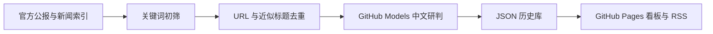

# 中国钢铁全球政策情报看板

每天自动采集与中国钢铁有关的法规、贸易救济、配额/关税、原产地、碳政策、市场和企业新闻，生成中文摘要与出口影响判断，并通过 GitHub Pages 发布静态看板。每条情报都保留官方或原始网页链接。

## 看板包含什么

- **正式法规优先**：EUR-Lex 的 L 系列法规和 C 系列公告分别采集，不把新闻和法律文件混为一类。
- **重点市场官方来源**：欧盟官方公报、美国 Federal Register、GOV.UK。
- **全球新闻覆盖**：通过 GDELT DOC 2.0 获取多国媒体和政府网站的原始链接。
- **中文研判**：GitHub Actions 使用 GitHub Models 自动翻译、摘要、分类，并回答“对中国钢厂/出口商意味着什么”。
- **历史与去重**：近似标题和规范化 URL 去重；历史情报默认保留 730 天。
- **健康隔离**：单个来源失败不会中断其他来源，也不会删除已有历史数据。
- **免费静态发布**：GitHub Pages，不需要服务器；GitHub Models 使用工作流自带的 `GITHUB_TOKEN`，无需另配 OpenAI API Key。

## 自动更新时间

工作流每天按德国杜塞尔多夫时间 **07:50** 运行。GitHub cron 只接受 UTC，因此配置了 05:50 和 06:50 两个候选时点，再依据 `Europe/Berlin` 当天的夏令时偏移只放行其中一次，保证冬夏时间切换后仍是当地 07:50。

GitHub 的定时任务在平台繁忙时可能延迟数分钟；这不改变应运行的当地日期和时段。

## 首次部署

1. 把项目推送到公开仓库 `Davidzhu511/china-steel-policy-watch`，默认分支使用 `main`。
2. 打开仓库 **Settings → Actions → General → Workflow permissions**，选择 **Read and write permissions**。
3. 打开 **Settings → Pages → Build and deployment**，将 Source 设为 **GitHub Actions**。
4. 进入 **Actions → 每日更新并部署看板 → Run workflow**，手动执行首轮更新。
5. 成功后访问 `https://davidzhu511.github.io/china-steel-policy-watch/`。

## 本地运行

```bash
python -m pip install -e ".[dev]"
pytest
python -m steelwatch render
python -m http.server 8000 --directory docs
```

浏览器打开 `http://localhost:8000`。本地没有 GitHub Models 令牌时可以正常渲染已有数据；只有新情报的自动中文分析会等到 GitHub Actions 运行时完成。

如需在本地完整更新，可提供具有 `models:read` 权限的令牌：

```bash
export GH_MODELS_TOKEN="..."
python -m steelwatch update
```

## 配置来源和关键词

所有配置在 [`config/sources.json`](config/sources.json)：

- `sources.*.enabled`：启停某个来源；
- `lookback_days`：每次回看天数；
- `queries`：官方搜索或 GDELT 查询；
- `keywords.china`：中国钢企和中国主体词；
- `keywords.materials`：钢铁产品、原料和加工品；
- `keywords.global_steel_policy`：即使标题未直接写 China，仍会影响中国出口的普遍性钢铁政策；
- `official_domains`：把新闻索引中的政府/国际组织域名升级为官方来源。

建议先扩充配置再改程序。新增查询应保持“主体词 + 钢铁词 + 措施词”的组合，避免抓入体育、影视或泛金属噪声。

## 数据流



## 目录

```text
config/sources.json       来源、查询与关键词
steelwatch/               采集、去重、翻译和生成逻辑
data/                     可追溯历史数据与运行状态
docs/                     GitHub Pages 静态看板
tests/                    离线单元测试
.github/workflows/        每日更新、部署和 CI
```

## 准确性边界

程序是“发现和初筛工具”，不是法律数据库替代品。模型不得补造税率、期限或产品范围，摘录不足时应明确提示；但业务决策前仍必须打开原文，核对税号、产品描述、原产地、生产商税率、适用期和后续修订。

媒体内容只保存短中文摘要和原始链接，不保存新闻全文。正式法规以发布机关文本为准。

## 常见问题

**Actions 显示 `Resource not accessible by integration`**

检查仓库 Actions 的 Workflow permissions 是否允许读写，并确认工作流含有 `contents: write`、`pages: write` 和 `models: read`。

**Pages 部署失败**

先在 Settings → Pages 把 Source 设为 GitHub Actions，然后重新运行工作流。

**某一来源显示异常**

历史情报仍会保留。可打开 `data/status.json` 查看来源错误；网站改版时只需修复对应 collector。

## 许可与声明

代码采用 MIT License。机器翻译与摘要仅供业务筛查，不构成法律意见；正式要求以原文及主管机关解释为准。
